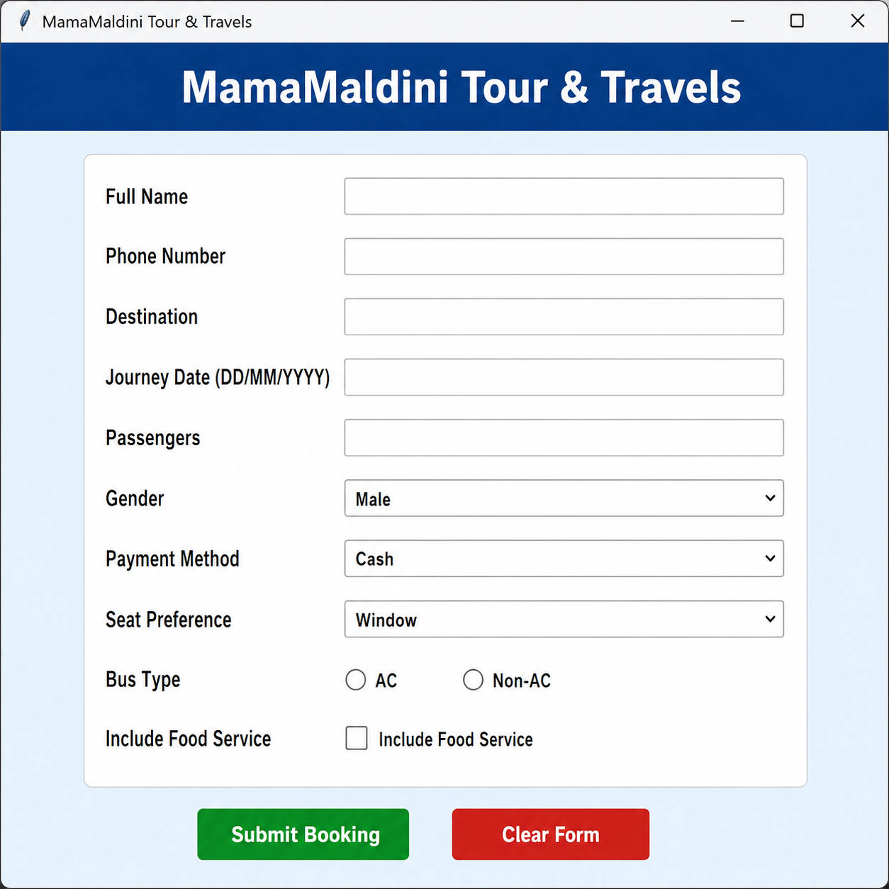

# MamaMaldini Tour & Travels

> **A simple and beginner-friendly Travel Booking System built with Python & Tkinter.**

This project is a desktop GUI application that lets users book tickets, choose their travel preferences, and automatically save every booking in a text file.

---

## Application Preview:



---

## Features:

- Modern and clean GUI
- Passenger information form
- Gender selection
- Multiple payment options
- Seat preference selection
- AC / Non-AC travel selection
- Optional food service
- Automatic booking timestamp
- Saves bookings to `bookings.txt`
- Input validation
- One-click form reset

---

## Built With:

- Python 
- Tkinter
- ttk Widgets
- datetime
- File Handling

---

## Project Structure:

```text
MamaMaldini-Tour-Travels/
│
├── travelform.py
├── Bookings.txt
├── Screenshot.png
├── booking.txt
└── README.md
```

---

## Booking Details:

The application records:

- Full Name
- Phone Number
- Destination
- Journey Date
- Number of Passengers
- Gender
- Payment Method
- Seat Preference
- Bus Type
- Food Service

---

## How It Works:

```text
Open Application
      │
      ▼
Fill Booking Form
      │
      ▼
Click "Submit Booking"
      │
      ▼
Input Validation
      │
      ▼
Save Booking → bookings.txt
      │
      ▼
Show Success Message
      │
      ▼
Clear Form
```

---

## Learning Outcome:

- Tkinter GUI Development
- Python File Handling
- Event Handling
- Form Validation
- Desktop Application Development
- Using Variables and Functions

---

## Future Improvements:

- Ticket Generation
- SQLite/MySQL Database
- Admin Dashboard
- Fare Calculator
- Email Confirmation


---

